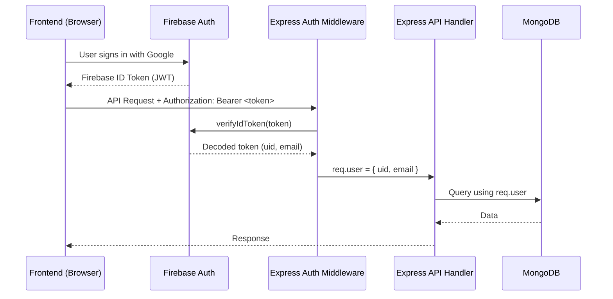

# Backend Authentication Middleware — Architecture Plan

> **Status:** Design document only. No code changes planned for this phase.

---

## 1. Current State

All API endpoints are **fully open** — no authentication or authorization is enforced:

```
GET  /api/dashboard/:userId     → Anyone can read any user's data
PUT  /api/users/:id             → Anyone can update any user's profile
POST /api/users/login           → Trusts all client-supplied claims
POST /api/roadmaps/generate     → Anyone can trigger AI generation
POST /api/github/analyze        → Anyone can trigger GitHub analysis
POST /api/skill-gap/analyze     → Anyone can trigger Skill Gap analysis
POST /api/job-matches/create    → Anyone can trigger job matching
POST /api/resume/upload         → Anyone can upload files
```

---

## 2. Proposed Architecture

### Token-Based Authentication using Firebase Admin SDK



### Key Design Decisions

| Decision | Choice | Rationale |
|----------|--------|-----------|
| Token type | Firebase ID Token (JWT) | Already using Firebase on frontend; no need for custom JWT |
| Verification | Firebase Admin SDK (`admin.auth().verifyIdToken()`) | Cryptographically verified, no shared secret needed |
| Token transport | `Authorization: Bearer <token>` header | Industry standard |
| User identity mapping | Match `token.email` → MongoDB `User.email` | Existing schema already has `email` field |
| Session management | Stateless (token per request) | No server-side session store needed |

---

## 3. Implementation Components

### 3.1 New Dependency

```bash
cd backend && npm install firebase-admin
```

### 3.2 Firebase Service Account Key

1. Firebase Console → Project Settings → Service Accounts
2. Click "Generate new private key"
3. Save as `backend/serviceAccountKey.json` (add to `.gitignore`)
4. Set env var: `GOOGLE_APPLICATION_CREDENTIALS=./serviceAccountKey.json`

### 3.3 Auth Middleware (`backend/middleware/authMiddleware.js`)

```javascript
// Pseudocode — not to be implemented yet
const admin = require("firebase-admin");

// Initialize Firebase Admin
admin.initializeApp({
  credential: admin.credential.cert(serviceAccount)
});

const authMiddleware = async (req, res, next) => {
  const authHeader = req.headers.authorization;
  if (!authHeader?.startsWith("Bearer ")) {
    return res.status(401).json({ error: "Missing auth token" });
  }

  try {
    const token = authHeader.split("Bearer ")[1];
    const decoded = await admin.auth().verifyIdToken(token);
    req.user = { uid: decoded.uid, email: decoded.email };
    next();
  } catch (error) {
    return res.status(401).json({ error: "Invalid or expired token" });
  }
};
```

### 3.4 Route Protection Strategy

| Route | Auth Required | Authorization Rule |
|-------|---------------|-------------------|
| `GET /` | No | Public health/status |
| `GET /health` | No | Public monitoring |
| `POST /api/users/login` | Yes (token) | Creates/finds user by token email |
| `GET /api/dashboard/:userId` | Yes | `req.user.email` must match user's email |
| `PUT /api/users/:id` | Yes | Can only update own profile |
| `POST /api/roadmaps/generate` | Yes | `userId` in body must match own user ID |
| `POST /api/github/analyze` | Yes | `userId` in body must match own user ID |
| `POST /api/skill-gap/analyze` | Yes | `userId` in body must match own user ID |
| `POST /api/job-matches/create` | Yes | `userId` in body must match own user ID |
| `POST /api/resume/upload` | Yes | `userId` in body must match own user ID |
| `GET /api/users` | Yes | Admin only (future) |

### 3.5 Frontend Changes

The frontend `AuthContext.jsx` would need to:
1. Get the Firebase ID token: `await auth.currentUser.getIdToken()`
2. Include it in every API call: `headers: { Authorization: \`Bearer \${token}\` }`

A utility wrapper or Axios interceptor can handle this globally.

---

## 4. Migration Path

### Phase A: Add Middleware (Non-Breaking)

1. Install `firebase-admin` on backend
2. Create `authMiddleware.js`
3. Apply middleware to routes **but make it optional** during transition:
   - If token present → verify it
   - If no token → allow (backward compatible)
4. Update frontend to start sending tokens

### Phase B: Enforce (Breaking)

1. Remove the "allow without token" fallback
2. All requests without valid token get `401`
3. Mock Auth mode would need to generate mock tokens or bypass middleware locally

### Phase C: Authorization

1. Add ownership checks: users can only access their own data
2. Add admin role for multi-user management
3. Rate limiting per authenticated user

---

## 5. Mock Auth Compatibility

For local development without Firebase:
- The auth middleware should check an env var `SKIP_AUTH=true`
- When `SKIP_AUTH=true`, the middleware extracts `userId` from the request body/params directly (current behavior)
- This preserves the demo-friendly Mock Auth experience

---

## 6. Dependencies & Impact

| Component | Impact | Effort |
|-----------|--------|--------|
| `backend/package.json` | Add `firebase-admin` | 5 min |
| New: `backend/middleware/authMiddleware.js` | Create middleware | 1 hour |
| `backend/routes/*.js` | Add middleware to routes | 30 min |
| `frontend/src/context/AuthContext.jsx` | Add token to API calls | 30 min |
| All frontend API calls | Add Authorization header | 1 hour |
| Testing | End-to-end auth flow verification | 2 hours |
| **Total estimated effort** | | **~5 hours** |

---

## 7. Risks & Mitigations

| Risk | Mitigation |
|------|-----------|
| Breaking Mock Auth mode | `SKIP_AUTH` env var bypass |
| Token expiry during long sessions | Firebase tokens auto-refresh; use `getIdToken(true)` for force-refresh |
| Firebase Admin SDK cold start | Initialize once at server boot, not per-request |
| Service account key management | Use env vars or secret manager in production |
